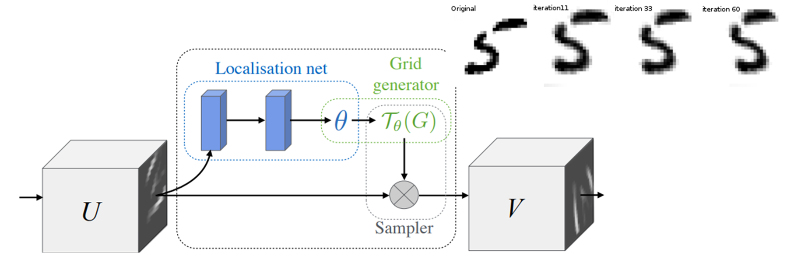
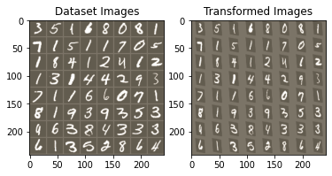

# Spatial Transformer Tutorial

This is a tutorial for spatial transformer in Sookmyung Wonmen's Univ's Deep Learning Course 2022 with Prof. Joo Yong Sim
```
Source: https://github.com/pytorch/tutorials/blob/master/advanced_source/neural_style_tutorial.py
```

## Question: Can we learn how to augment in your network?
- Learn geometric invariance of the model (translation, crop, scale, shear, … etc)
- Visual attention mechanism


<div align="center">
  
</div>
<br>

## Result
The network learns how to transform the input


<div align="center">
  
</div>
<br>
